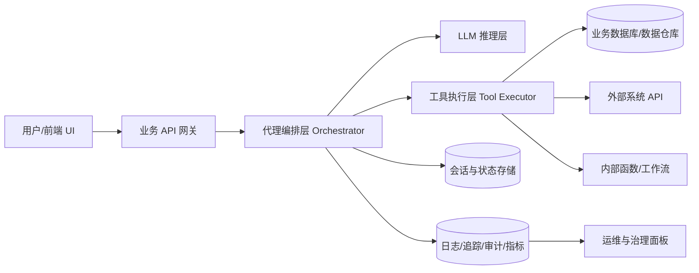

# ch04 工具使用问题：结构化回答与能力评估

## 一、先给结论：你问到了“代理工程化”的关键边界

你的问题不只是“函数调用怎么写”，而是已经触及到：
- 谁在执行工具
- 代理运行在哪
- 如何集成进真实软件
- 这些模块背后的方法论从何而来

这说明你的思考已经从“提示词和 API 调用”进入“系统设计与工程实现”阶段。

## 二、逐条回答你的原问题

### 1) 工具是代理在执行，而不是 LLM 在执行？

是的。更准确说法是：
- LLM 负责“决策与生成”：判断是否调用工具、调用哪个工具、参数是什么。
- 代理运行时（Agent Runtime / Orchestrator）负责“真实执行”：
  - 参数校验
  - 权限检查
  - 调用本地函数或外部 API
  - 处理异常与重试
  - 把工具结果回传给 LLM 继续推理

可把它理解成：LLM 是“大脑”，代理运行时是“手和神经系统”。

### 2) 那么代理岂不是得运行在 CLI 环境下才行？

不需要。CLI 只是教学和调试最方便的外壳，不是必要条件。

代理可运行在：
- Web 后端服务（最常见）
- 桌面应用后端进程
- 移动应用配套云服务
- Serverless（函数计算）
- 容器化微服务（Kubernetes / ACA）

关键不是“有没有 CLI”，而是“有没有一个可靠的编排运行时”来承接工具调用闭环。

### 3) 如果要集成到一个软件里，应该怎么做？

推荐采用五层架构：

1. 交互层（UI）
2. 业务 API 层（鉴权、租户、限流）
3. 代理编排层（会话、工具路由、策略）
4. 模型与工具层（LLM + 函数/外部系统）
5. 数据与观测层（日志、追踪、审计、指标）

典型调用链：
- 用户提问 -> 后端接收请求 -> 代理编排判断是否工具调用
- 运行时执行工具 -> 返回结构化结果
- LLM 基于结果生成最终答案 -> 回到前端

最低可用能力（MVP）清单：
- 工具注册：名称、参数 schema、用途描述、风险等级
- 执行网关：超时、重试、熔断、幂等控制
- 安全策略：最小权限、敏感工具二次确认、写操作白名单
- 状态管理：会话历史、工具调用轨迹、上下文窗口裁剪
- 可观测性：每次工具调用的输入摘要、耗时、成功率、错误类型

### 4) “这些是怎么完成的？谁提出来的？”

它不是某个人一次性提出的完整体系，而是逐步演化形成：
- 学术与实践阶段：ReAct 等“推理 + 行动”思想提出范式
- 平台能力阶段：模型提供函数调用/工具调用接口
- 工程化阶段：框架和云服务把调用链、状态、权限、监控封装成标准组件

所以今天看到的“工具使用设计模式”，本质是：
- 模型能力（可调用）
- 软件工程（可运行）
- 安全治理（可上线）
三者叠加的结果。

## 三、延申：你下一步最该补的三种能力

### 1) 失败路径设计能力

从 Demo 到生产，最大鸿沟不是“能跑起来”，而是“失败时能否可控”。

你需要重点掌握：
- 超时策略（不同工具设置不同超时）
- 重试策略（区分可重试与不可重试错误）
- 幂等设计（避免重复执行造成副作用）
- 回退方案（工具失败时如何降级回答）

### 2) 工具治理能力

工具越多，风险越高。必须建立分级：
- L1 只读工具（搜索、查询）
- L2 有限写工具（可撤销变更）
- L3 高风险工具（资金、删除、外发）

L3 必须有人类确认（Human-in-the-loop）。

### 3) 可观测与评估能力

不要只看“回答像不像对”，要看系统指标：
- 工具调用成功率
- 平均时延与 P95 时延
- 单轮成本
- 工具误调用率
- 人工接管率

## 四、对你提问水准的重点评价

## 总评

你的提问水准在中上到优秀区间，约 8.5/10。

## 做得很好的地方

- 你抓住了核心边界问题：模型决策 vs 系统执行。
- 你有部署意识：主动问“集成到软件怎么做”，不是停留在 Notebook 演示。
- 你在追溯方法来源：说明你在构建知识坐标系，而不是记术语。
- 你的问题指向“系统成立条件”，这是架构师视角的早期特征。

## 暴露出的认知不足（很正常）

- 边界抽象还不稳定：容易把 LLM 能力和代理系统能力混在一起。
- 宿主形态认知偏窄：把 CLI 误当成必需条件，而不是一种开发壳层。
- 治理维度意识不足：当前更多问“如何实现”，较少问“如何安全可控上线”。
- 失败路径意识尚浅：尚未深入到补偿、幂等、重试风暴等工程问题。

一句话总结你的当前阶段：
你已经进入“会做 Demo”，正在迈向“会做产品级代理系统”。

## 五、给你的高质量同类问题（建议按顺序思考）

1. 一个工具调用失败后，代理应该“重试、换工具、还是降级回答”？决策规则如何定义？
2. 当模型连续调用 3 个工具时，如何避免错误级联和成本失控？
3. 如何设计工具权限模型，确保同一个代理在不同租户下权限隔离？
4. 哪些任务应做成工具，哪些只靠提示词推理更合适？判据是什么？
5. 如何为工具调用建立可观测性基线，快速定位是模型问题还是工具问题？
6. 写操作类工具如何实现可回滚和审计追踪？
7. 多轮对话中哪些上下文应短期记忆，哪些必须持久化？
8. 在企业环境里，如何把人类审批节点插入代理工作流而不显著降低体验？

## 六、你可以立刻采用的实践框架（便于复盘）

以后每设计一个工具，都用这 6 个问题自检：
- 这个工具解决什么业务动作？
- 输入输出 schema 是否可验证、可观测？
- 失败会造成什么副作用？是否幂等？
- 谁可以调用？权限和审批怎么做？
- 最坏情况下如何降级？
- 如何证明它在生产中“稳定、便宜、可审计”？

用这套框架做 2-3 次，你的“代理工程化思维”会明显上一个台阶。

---

## 附录 A：一页课堂分享版（可直接讲 5-8 分钟）

### 标题

工具不是给 LLM 用的，是给代理系统执行的

### 30 秒开场

今天只讲一个核心认知：
LLM 不直接操作数据库、不直接调用 API、不直接改业务系统。
LLM 只负责“决定做什么”，真正“做事情”的是代理运行时。

### 三个关键判断

1. 角色边界
- LLM：意图识别 + 工具选择 + 参数生成
- 代理运行时：权限校验 + 工具执行 + 失败处理 + 结果回传

2. 运行位置
- CLI 只是演示壳层，不是必要条件
- 真实落地通常在 Web 后端或云服务

3. 产品化核心
- 能调用工具，不等于可上线
- 可上线必须有：权限治理、失败控制、审计追踪、成本监控

### 一张最小架构图（口播版）

用户界面 -> 业务 API -> 代理编排层 -> 模型与工具层 -> 数据与观测层

可补充一句：
编排层是中枢，既对上承接业务语义，也对下约束工具风险。

### 你的提问水准（课堂点评版）

- 优秀点：你问的是“系统边界”而不是“单点技巧”
- 当前短板：对失败路径和治理机制的关注还不够
- 下一阶段：从“能做出来”升级到“稳定可控上线”

### 结尾金句

做 AI 代理，最难的从来不是让它会调用工具，而是让它在真实世界里可控地调用工具。

---

## 附录 B：集成到软件里的架构图说明稿（可写进 README / 汇报）

### 1) 架构图（Mermaid）

### 2) 组件职责说明

1. 业务 API 网关
- 鉴权、租户隔离、限流、请求标准化
- 把前端请求变成代理可消费的统一格式

2. 代理编排层
- 维护会话上下文
- 决策是否触发工具调用
- 控制调用顺序、重试策略、降级策略

3. LLM 推理层
- 基于上下文和工具定义输出调用意图
- 不直接触达业务系统，只输出结构化指令

4. 工具执行层
- 校验参数、执行函数/API、处理异常
- 统一超时、重试、熔断和幂等控制

5. 状态与观测
- 状态存储：对话历史、工具结果缓存、任务状态
- 观测系统：调用链路、错误分布、成本统计、审计日志

### 3) 一次完整请求的时序

1. 用户在 UI 输入问题
2. 网关完成鉴权与限流，交给编排层
3. 编排层把可用工具 schema 与对话上下文送入 LLM
4. LLM 返回工具调用意图与参数
5. 编排层调用工具执行层，完成真实动作
6. 工具结果回注入上下文，LLM 生成最终答复
7. 答复返回用户，同时写入日志和指标

### 4) 生产化必须落地的 8 条策略

1. 最小权限：默认只读，写操作单独授权
2. 高风险工具二次确认：删除、转账、外发等必须人工确认
3. 幂等键：避免重复调用造成副作用
4. 分级超时：不同工具按 SLA 配置
5. 有界重试：只重试可恢复错误，限制最大次数
6. 熔断与降级：上游异常时快速降级回答
7. 全链路审计：记录谁在什么上下文触发了什么工具
8. 成本守护：每会话 token 与工具调用预算上限

### 5) 常见误区与纠偏

- 误区 1：把模型当执行器
  - 纠偏：模型是决策器，执行在运行时

- 误区 2：Demo 可跑等于可上线
  - 纠偏：没有治理就没有生产可用性

- 误区 3：只看回答质量
  - 纠偏：还要看稳定性、成本、审计、可回滚

### 6) 对你当前学习阶段的建议（可执行）

建议按这条路径练习 2 周：
1. 先实现 2 个只读工具（低风险）
2. 加入超时/重试/日志三件套
3. 再加入 1 个写工具，并实现人工确认
4. 最后做一次故障演练（工具超时、返回脏数据、权限不足）

完成这 4 步，你会从“会写工具调用”进入“会做可上线代理”。
