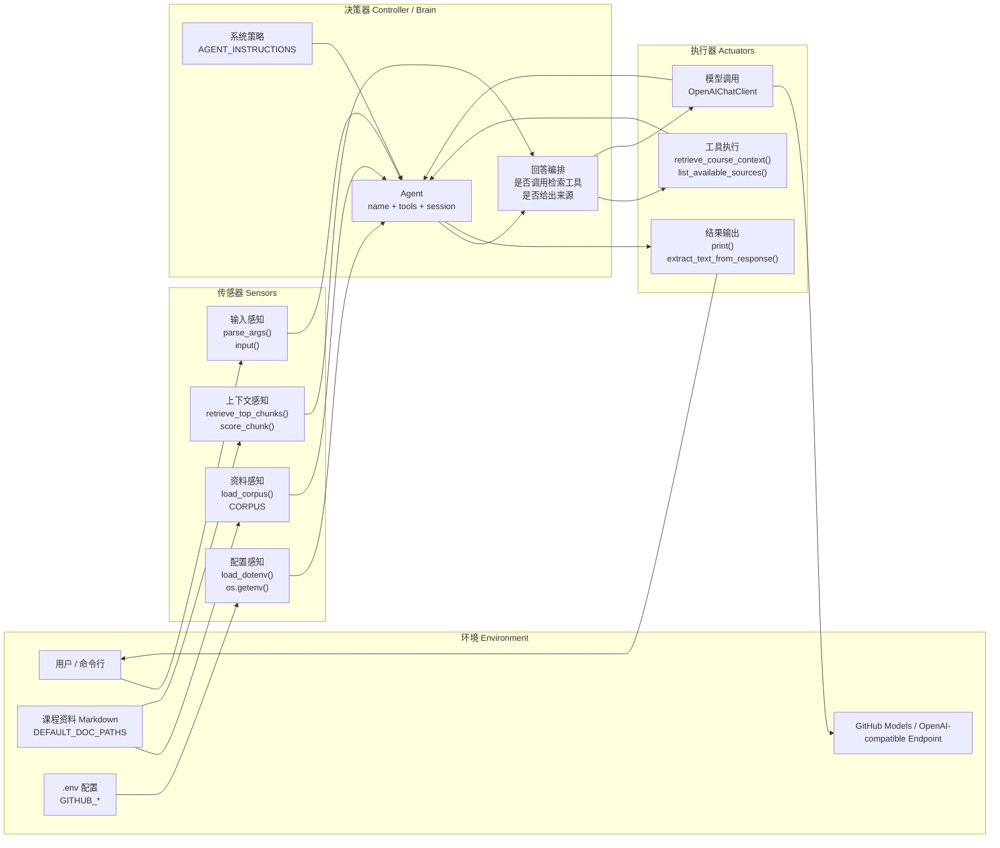
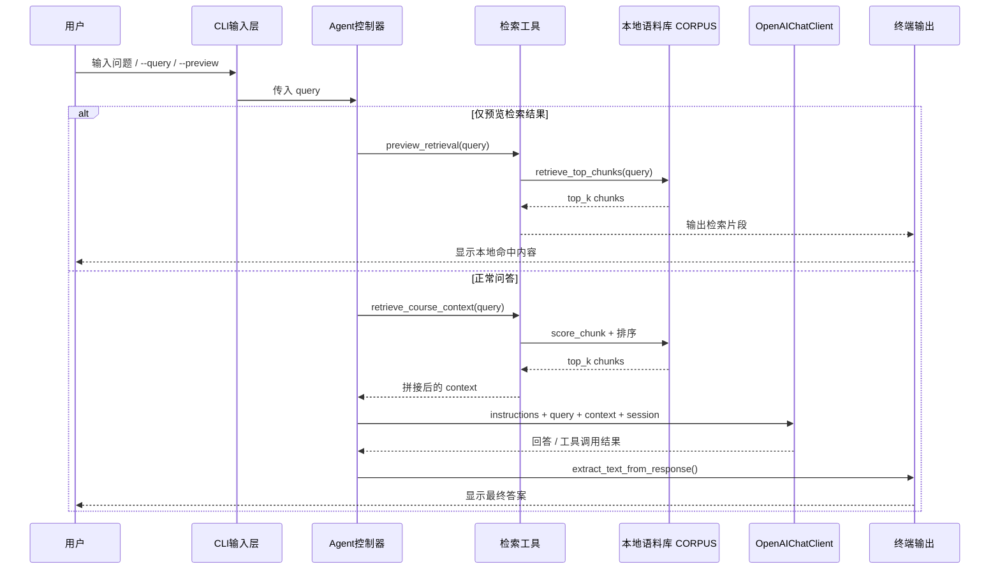

# CourseQAAgent Architecture

这个最小 Agent 可以按经典智能体视角拆成 4 层：

- 环境：用户、课程资料、`.env` 配置、外部模型服务
- 传感器：接收问题、读取本地资料、感知可用配置
- 决策器：根据系统指令决定是否检索、如何组织回答
- 执行器：调用工具、请求模型、把结果输出给用户

## 1. 智能体分层架构图

## 2. 一次问答的执行流

## 3. 代码到架构角色的映射

| 架构角色 | 对应实现 | 说明 |
| --- | --- | --- |
| 环境 | `DEFAULT_DOC_PATHS`、`.env`、用户输入、模型服务 | Agent 运行时依赖的外部世界 |
| 传感器 | `parse_args()`、`input()`、`load_corpus()`、`retrieve_top_chunks()` | 负责感知问题、资料和配置 |
| 决策器 | `Agent(...)`、`AGENT_INSTRUCTIONS`、`session` | 决定先检索还是直接答、如何输出 |
| 执行器 | `retrieve_course_context()`、`list_available_sources()`、`OpenAIChatClient`、`print()` | 把决策转成具体动作 |

## 4. 你汇报时可以直接这样讲

可以把这个最小 Agent 概括成一句话：

> 它先通过“传感器”感知用户问题和本地课程资料，再由 Agent 决策器判断是否调用检索工具，最后通过执行器去调用模型并把答案返回给用户。

如果老师追问它是不是“闭环”，更准确的说法是：

> 严格来说，它更接近开环问答系统：接收问题后检索资料并生成答案，但输出后不会再观察答案效果，也不会基于环境反馈自动修正。

不过在单次问答内部，它有一个局部反馈链路：

> Agent 可以先调用检索工具拿到 context，再基于这个返回结果继续生成回答，所以它不是完全无反馈，但还不是带外部结果校正的完整闭环。
